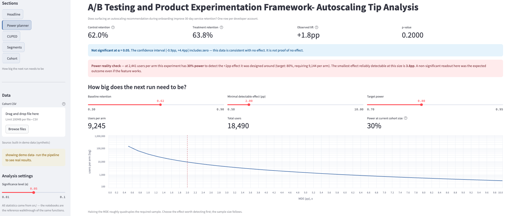

# A/B Testing & Product Experimentation Framework

An end-to-end framework for designing, simulating, and analyzing whether a product change actually makes a difference- *does showing new developers an autoscaling tip during signup help them stick around?*

Real developer profiles are pulled from the GitHub API and experiment outcomes are simulated on top of those profiles. The result is a realistic, runnable A/B test that can be explored in a browser dashboard, including what happens when the test is underpowered, which is the most common way real experiments fail. The framework covers pre-experiment power analysis, CUPED variance reduction, and side-by-side Bayesian and frequentist readouts, with a Streamlit dashboard for interactive exploration.

## The question being answered

When a developer signs up for a cloud platform, they typically hit a wall, their app goes down because traffic spiked and they didn't set up autoscaling. If we show them a helpful tip about it right at the start, does that reduce early drop-off?
This project runs that experiment on synthetic data seeded from real GitHub developer profiles.

This framework includes:
- **Pre-experiment power analysis** to know the sample size before shipping a product
- **CUPED (Controlled-experiment Using Pre-Experiment Data)** to reduce variance and detect smaller effects with the same samples
- **Bayesian and frequentist readouts** side by side, so stakeholders can reason about results in their preferred framework
- **A Streamlit dashboard** for interactive stakeholder results exploration

**Product context:** Does surfacing an autoscaling recommendation card during the new user onboarding flow improve 30-day service retention?

**Hypothesis:** Developers who see an autoscaling tip during onboarding will be more likely to still have an active service after 30 days.

## Quickstart

```bash
git clone https://github.com/yourhandle/experimentation-framework
cd experimentation-framework
pip install -r requirements.txt

# 1. Fetch developer profiles once (set GITHUB_TOKEN for 5,000 requests/hour) & 
# Simulate outcomes with a known +2pp true effect baked in
python -m data.github_fetch
python -m data.simulate_cohort

# 2. Do the same for n=500
python -m data_N500.github_fetch
python -m data_N500.simulate_cohort

# 3. Conduct a power anlaysis and run the results
python -m src.power_analysis
python -m src.stats  --cohort data_N500/cohort_500.csv
python -m src.cuped  --cohort data_N500/cohort_500.csv
python -m src.stats  --cohort data/cohort.csv
python -m src.cuped  --cohort data/cohort.csv

# 4. Explore interactively (the dashboard reads data/cohort.csv or upload any cohort)
streamlit run app/dashboard.py

# Notebooks: the full narrative walkthrough
jupyter lab notebooks/
```

The dbt models under `dbt/` are warehouse-agnostic and don't depend on one specific data warehouse; install the adapter for your warehouse plus the `dbt-utils` package to run them.

 The notebooks and dashboard import those same functions rather than reimplementing them, so a number shown in the dashboard is the number the pipeline computed.


## Tech stack

| Layer | Tools | What it's doing here |
|---|---|---|
| **Statistics** | statsmodels, SciPy | Power solver (NormalIndPower, Cohen's *h*), two-proportion z-test, Wald intervals, Welch tests for balance and CUPED-adjusted outcomes |
| **Data handling** | pandas, NumPy | Cohort manipulation, vectorized simulation, covariate construction |
| **Data source** | GitHub REST API via requests | Real developer profiles — account age, repos, language, commit streak |
| **Warehouse transforms** | dbt (warehouse-agnostic) | Event normalization and the three analysis marts; dbt-utils for schema tests |
| **Dashboard** | Streamlit, Altair | Interactive readout with a section nav, power planner, and CUPED/segment views |
| **Notebooks** | JupyterLab, matplotlib | The narrative walkthrough — exploration, design, results |
| **Tests** | pytest | 63 tests checking the readouts against hand-derived formulas |


## Headline results: two runs, same experiment

| | **n = 500** | **n = 5,000** | Truth |
|---|---:|---:|---:|
| Control retention | 59.8% (n=256) | 62.0% (n=2,530)| 61% |
| Treatment retention | 66.4% (n=244) | 63.7% (n=2,470) | — |
| **Observed lift** | **+6.6pp** | **+1.7pp** | **+2.0pp** |
| 95% CI | [−1.8, +15.1] | [−1.0, +4.3] | — |
| CI width | 16.9pp | 5.4pp | — |
| p-value | 0.125 | 0.222 | — |
| P(treatment > control) | 93.7% | 88.7% | — |
| Verdict | Not significant | Not significant | — |

**At n=5,000** the observed lift lands almost exactly on the true effect and the test still can't distinguish it from zero, because the confidence interval is wider than the effect itself. That isn't a bug, it is what the power analysis predicted.

**The Bayesian row is the one to read,** the smaller, noisier run seem more convincing (93.7% vs 88.7%) because it happened to observe a much larger effect, and the posterior reliably reports what it saw. Switching the approach doesn't rescue an underpowered experiment, rather it just restates the same uncertainty.


## What the power analysis says

`src/power_analysis.py` explains exactly why the small run misled us:

| Sample size | Statistical power | Smallest effect reliably detectable |
|---|---|---|
| 250 / arm | **7%** | 12.2pp |
| 2,500 / arm | **31%** | 3.9pp |
| **9,245 / arm** | **80%** | **2.0pp** |




To reliably detect a 2pp lift on a 61% baseline, you need **9,245 developers per arm, about 18,500 total.** At 250/arm, power is 7%, the experiment was essentially incapable of finding the truth, so anything it did report was noise.

Note that on th 250/arm row, the smallest effect that a cohort can reliably detect is 12.2pp, yet it reported +6.6pp- an estimate well below its own detection floor. When a run produces a number it isn't qu to measure, the number is describing sampling noise and not the feature.

At n=2,500/arm we had less than a 50/50 chance of detecting a real 2pp effect. The non significant result was the *expected* outcome even though the feature works.


## The small-cohort (N = 500) produced a cautionary tale 

At 250 per arm the estimate came in at more than triple the baked truth, serving as a reminder that small samples don't just miss effects, sometimes they exaggerate them. If this run crossed p < 0.05, the feature would've shipped expecting a 6.6pp lift and spent the next quarter reports less than ideal.

The segment breakdown is where it things dangerous, it demonstrates how subgroup analysis can mislead. Despite both experiments simulating the same underlying effect, the subgroup results tell very different stories.


| Segment | n = 500 | n = 5,000 |
|---|---|---|
| early_career | −0.3pp [−12.8, +12.2] *p=0.96, n=245* | +0.5pp [−2.7, +3.8] *p=0.75, n=3,543* |
| **experienced** | **+14.2pp [+2.5, +25.9]** *p=0.02, n=223* | +4.7pp [−0.7, +10.1] *p=0.09, n=1,054* |
| active_hobbyist | +9.8pp [−21.4, +41.0] *p=0.54, n=32* | +1.4pp [−6.6, +9.3] *p=0.73, n=340* |
| newcomer | *too few to report* | −7.8pp [−32.2, +16.7] *p=0.54, n=63* |

The experienced segment appears to show a statistically significant +14.2pp improvement in the n=500 experiment, which is more than seven times larger than the true effect even though the overall experiment was not statistically significant. This is a classic example of a false positive arising from multiple subgroup comparisons, when several segments are tested in a noisy dataset, it is not unusual for one to appear significant by chance alone.

With n=5,000, the same segment's estimated effect shrinks to +4.7pp and is no longer statistically significant, illustrating why subgroup findings from underpowered experiments should be interpreted cautiously.

Confidence intervals provide the clearest picture of this uncertainty. The active_hobbyist segment (n=32) has a CI spanning 62pp, while newcomer (n=63) spans 49pp. Intervals this wide indicate that the estimates are dominated by sampling variability rather than providing reliable evidence of a treatment effect. For this reason, all segment-level analyses in this project are presented as exploratory and are intended to generate hypotheses for future experiments.

## CUPED: variance reduction in practice

CUPED (Controlled-experiment Using Pre-Experiment Data) uses each user's pre-experiment behavior score to soak up outcome variance the treatment didn't cause.

| | **n = 500** | | **n = 5,000** | |
|---|---:|---:|---:|---:|
| | Naive | CUPED | Naive | CUPED |
| Lift (pp) | 6.63 | 6.42 | 1.67 | 1.44 |
| 95% CI (pp) | [−1.83, +15.08] | [−1.88, +14.73] | [−1.01, +4.35] | [−1.18, +4.06] |
| CI width (pp) | 16.91 | 16.61 | 5.36 | 5.24 |
| p-value | 0.125 | 0.130 | 0.222 | 0.282 |

| | n = 500 | n = 5,000 |
|---|---:|---:|
| Correlation (score vs retention) | 0.186 | 0.211 |
| Variance removed | 3.4% | 4.4% |
| Theta (θ) | 0.453 | 0.600 |
| CI narrowing | 1.8% | 2.2% |

Variance removed tracks the square of the correlation almost exactly (0.211² ≈ 4.5%), which is the theoretical guarantee of CUPED. This illustrates an important property of CUPED: the better your pre-experiment metric predicts the outcome, the more variance you can remove. 

The payoff is modest here because the covariate (the composite GitHub activity score) is only weakly correlated with retention. A stronger baseline metric like prior deployment frequency, historical commit activity, or another behavior highly correlated with retention, might have a correlation around r = 0.5. Since 0.5² = 0.25, CUPED would remove roughly 25% of the variance, substantially tightening confidence intervals and increasing statistical power without requiring a larger sample size.


One result may seem surprising: the confidence intervals become slightly narrower, yet the p-values increase (0.125 → 0.130 and 0.222 → 0.282). That isn't a contradiction, CUPED shrank the intervals but it also nudged the point estimate down slightly and the estimate moved proportionally more than the interval did. Narrower intervals improve precision on average across many experiments but they don't guarantee a smaller p-value in every individual experiment.

Randomization itself worked as intended for account age, repo count, commit streak, and pre-experiment score as all balance-check p-values > 0.3. This indicates that any observed differences after adjustment are unlikely to be caused by pre-existing imbalance.

## Where the data comes from

Developer profiles are fetched from the GitHub public API which does not required an API key for basic use. However, setting `GITHUB_TOKEN` raises the limit from 60 to 5,000 requests/hour. For each developer account age, number of public repositories, primary programming language, and recent commit activity were collected.

These signals group developers into realistic archetypes before the simulated experiment runs of early_career, experienced,  active_hobbyist & newcomer. Synthetic experiment data (of those who saw the tip, who didn't, whether they retained) is generated on top of those real profiles, so the fake data feels grounded rather than purely random.


## The dbt layer: preparing the experiment data for analysis

Before the experiment can be analyzed, the raw event data must be cleaned and organized. The dbt models remove duplicate events, keep each developer's most recent profile, and identify the first experiment assignment for every user.

Three marts define the experiment:

* **`experiment_assignments`** records each user's first assignment to the control or treatment group, users who appear in both groups are flagged instead of being silently excluded
* **`pre_experiment_covariates`** stores baseline metrics collected before a user enters the experiment, these are used by CUPED and prevent data leakage by excluding any information recorded after assignment
* **`user_metrics`** calculates the experiment's primary, secondary, and guardrail metrics relative to each user's own assignment date, results are only included once the full 30-day observation period has passed

The models are warehouse-agnostic using dbt's cross-database macros and are validated with 31 automated schema tests.

## What the project actually does

1. **Pulls real developer profiles** from the GitHub API as a realistic starting point
2. **Runs a power analysis** to establish required sample size before anything ships
3. **Splits developers into two groups** one sees the autoscaling tip, one doesn't; and verifies covariate balance
4. **Simulates retention outcomes** with a known true effect baked in
5. **Runs the statistical readout** frequentist and Bayesian, naive and CUPED adjusted, with segment breakdowns clearly flagged as exploratory
6. **Shows the results** in an interactive Streamlit dashboard you can run locally

---

## Repository structure

```
experimentation-framework/
│
├── data_N500/
│   ├── github_fetch_N500.py          # pulls developer profiles from GitHub API
│   └── simulate_cohort_N500.py       # generates retention outcomes on top of real profiles
│ 
├── data/
│   ├── github_fetch.py          
│   └── simulate_cohort.py       
│
├── dbt/
│   ├── models/staging/          # raw event normalization
│   └── models/marts/            # experiment_assignments, user_metrics, pre_experiment_covariates
│
├── src/
│   ├── power_analysis.py        # how many users do we need to run this test?
│   ├── experiment.py            # assigns users to control/treatment groups
│   ├── stats.py                 # significance test, calculates lift
│   └── cuped.py                 # CUPED application
│
├── notebooks/
│   ├── 01_data_exploration.ipynb    # what do our GitHub sourced profiles look like?
│   ├── 02_experiment_design.ipynb   # setting up the test before running it
│   └── 03_results.ipynb             # interpreting the outcome
│
├── app/
│   └── dashboard.py             # streamlit app to explore results interactively
│
├── requirements.txt
└── README.md
```

## Experiment design summary

| | |
|---|---|
| **Unit of randomization** | developer accounts (one / person, not / project) |
| **Primary metric** | active service after 30 days (30 day retention) |
| **Minimal detectable effect** | +2.0pp |
| **Required sample size** | 9,245 per arm (18,490 total), 80% power, α = 0.05 |
| **Secondary metrics** | time to first deploy, services created in 30 days |
| **Guardrail metrics** | onboarding completion rate, support ticket volume |
| **Experiment duration** | 28 days |
| **True simulated effect** | +2.0pp (known ground truth for validating the pipeline) |

## What this project doesn't handle

**Non-randomized rollouts** infrastructure features may ship in phases by passing clean randomization; difference-in-differences would be the next stage, which is not implemented here

**Users joining mid-experiment** everyone is assumed to start at once, real signups arrive continuously, requiring partial exposure windows

**Team accounts** multiple developers often share one account, so one person may see the tip and another may not causing interference and violating the assumptions underlying the significance test

**Multiple subgroup comparisons** segment results are shown for exploration only- when many subgroups are tested, some can appear statistically significant by chance, so additional statistical corrections are needed before drawing conclusions

## What this demo teaches

An experiment that returns "not significant" on a feature that genuinely works is not a bug, rather it is the default outcome of skipping the power analysis. The n=5,000 run recovered the true effect almost exactly (+1.7pp observed vs +2.0pp true) but couldn't certify it; while the N=500 run tripled it and p = 0.020. Ultimalety, one should run the power analysis first, size the cohort with a MDE, treat subgroup significance with suspicion, and then use CUPED to find more precision out of results.
